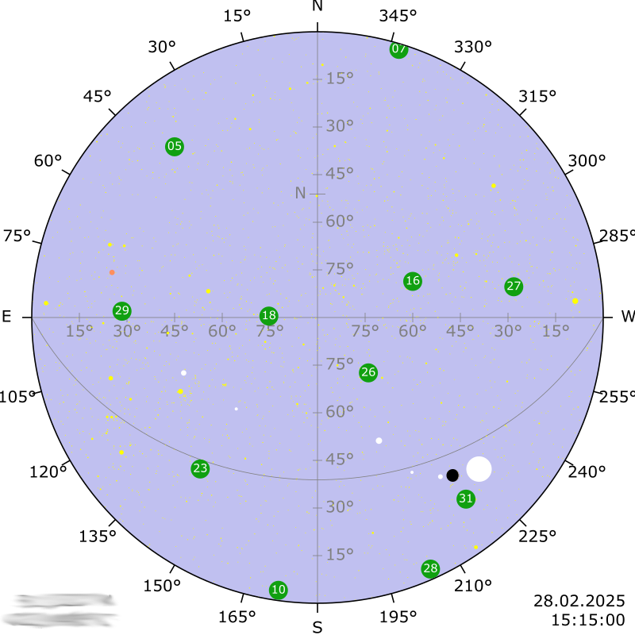
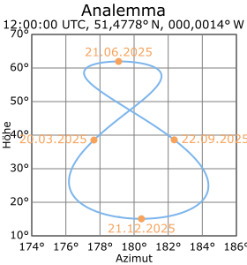

# weewx-skymap-almanac
Sky map for WeeWX



## Contents

* [Prerequisites](#prerequisites)
* [Installation instructions](#installation-instructions)
* [Configuration instructions](#configuration-instructions)
* [Styling](#styling)
* [Sky map](#sky-map)
* [Moon with moon phase](#moon-with-moon-phase)
* [Analemma](#analemma)
* [Styling](#styling)
  * [Dark mode of your web site](#dark-mode-of-your-web-site)
  * [General font setting](#general-font-setting)
  * [Special settings](#special-settings)
* [Changing visibility of elements by JavaScript](#changing-visibility-of-elements-by-javaScript)
* [How to check whether this extension is available?](#how-to-check-whether-this-extension-is-available)
* [Credits](#credits)
* [Links](#links)

## Prerequisites

WeeWX from version 5.2 on and weewx-skyfield-almanac

## Installation instructions

1) download

   ```shell
   wget -O weewx-skymap-almanac.zip https://github.com/roe-dl/weewx-skymap-almanac/archive/master.zip
   ```

2) run the installer

   WeeWX from version 5.2 on and WeeWX packet installation

   ```shell
   sudo weectl extension install weewx-skymap-almanac.zip
   ```

   WeeWX from version 5.2 on and WeeWX pip installation into an virtual environment

   ```shell
   source ~/weewx-venv/bin/activate
   weectl extension install weewx-skymap-almanac.zip
   ```
   
3) restart weewx

   for SysVinit systems:

   ```shell
   sudo /etc/init.d/weewx stop
   sudo /etc/init.d/weewx start
   ```

   for systemd systems:

   ```shell
   sudo systemctl stop weewx
   sudo systemctl start weewx
   ```

## Configuration instructions

There is no need to configure anything, but there are some tuning options
available if you have special requirements.

> [!NOTE]
> If you are new to this extension, please, do NOT change the configuration
> at the beginning. The installation sets reasonable values to all 
> configuration keys to immediately include the new tags into your skin.

```
[Almanac]
    [[Skymap]]
        # use this almanac
        enable = true
        # list of heavenly bodies to include in the map
        bodies = ...
        # list of earth satellites to include in the map
        earth_satellites = ...
        # maximum star magnitude to include in the map
        max_magnitude = 6.0
        # flag whether to include stars in the map
        show_stars = true
        # flag whether to include the timestamp
        show_timestamp = true
        # flag whether to include the location
        show_location = true
        # flag whether to show the ecliptic as a dotted line
        show_ecliptic = true
        # flag whether to show the constellation lines between the stars
        show_constellations = true
        # format options
        [[[Formats]]]
            stars = mag, '#ff0'
            object_name = size, color, ...
```

* `enable`: Enable this almanac extension.
* `bodies`: List of heavenly bodies to include in the map. Optional.
  Default the sun, the moon, and the well-known planets.
  This can include all objects available in BSP files.
* `earth_satellites`: List of earth satellites to include in the map.
  Optional. Default no satellites.
  The ID to use here contains of the file name of the
  satellite data file (without file name extension) and
  the catalog number of the satellite, connected by an underscore.
* `max_magnitude`: Maximum star magnitude to include in the map.
  Optional. Default is 6.0. This is, how you would see the sky
  in a clear night in the middle of nowhere. Try 4.0 if that
  looks more the way you know the sky in the night to be.
  Please note, the larger the magnitude, the fainter the star.
* `star_tooltip_max_magnitude`: Stars get a tooltip if their magnitude
  is less than this value. Optional. Default is 2.5. 
* `show_stars`: Flag whether to include stars in the map. Optional.
  Default `True`.
* `show_timestamp`: Flag whether to include the timestamp. Optional.
  Default `True`. 
* `show_location`: Flag whether to include the location. Optional.
  Default `True`.
* `show_ecliptic`: Flag whether to show the ecliptic as a dotted line.
  Optional. Default `True`.
* `show_constellations`: Flag whether to show the constellation lines
  between the stars. Optional. Default `True`. Uses the 
  `constellationship.fab` file of Stellarium.
* `moon_colors`: Colors for `moon_symbol`. Optional. Default
  `['#bbb4ac19','#ffecd5']`. The first value is the color of the dark
  side, the second color that of the sunlit side. For the dark side
  an opacity value can be provided.
* `analemma_colors`: Colors for `analemma`. Optional. Default
  `['currentColor','#808080','#7cb5ec','#f7a35c']`
* `[[[Formats]]]`: Format options. Optional.
  There are reasonable defaults. So you do not need this section at all.
  But if you want to set up something special you can do it here.
  Each entry contains an object name and a list of options. For example
  the line `stars = mag, "#ff0"` says that the stars are to be drawn
  with a diameter according to their magnitude and a color of yellow.
  This is also the default if no option is specified. A line 
  `mars_barycenter = 0.85, "#ff8f5e"` would draw the planet Mars
  with a radius of 0.85 and a reddish color. This is the default, too.
  For earth satellites a third parameter is possible describing the
  shape of the representation of the object. For example it can be
  `round`, `triangle`, `square`, or `rhombus`.

All the configuration options can also be used as parameters to the
attributes described below.

Example `[Almanac]` configuration section in `weewx.conf`:

```
[Almanac]
    [[Skyfield]]
        enable = true
        ephemeris = de440.bsp
        use_builtin_timescale = false
        timescale_url = https://datacenter.iers.org/products/eop/rapid/standard/finals2000A.all, ftps://gdc.cddis.eosdis.nasa.gov/products/iers/finals.all
        "#log_ftp" = false
        update_interval = 31557600
        enable_live_data = true
        disable_pyephem = false
        [[[EarthSatellites]]]
            stations.tle = https://celestrak.org/NORAD/elements/gp.php?GROUP=stations&FORMAT=tle
            gps.tle = https://celestrak.org/NORAD/elements/gp.php?GROUP=gps-ops&FORMAT=tle
            weather.tle = https://celestrak.org/NORAD/elements/gp.php?GROUP=weather&FORMAT=tle
    [[Skymap]]
        enable = true
        earth_satellites = weather_40732, weather_38552, weather_28912, stations_25544, gps_24876, gps_26360, gps_26407, gps_27663, gps_28190, gps_28474, gps_28874, gps_29486, gps_29601, gps_32260, gps_32384, gps_32711, gps_35752, gps_36585
        [[[Formats]]]
            gps_* = 3, "#10A010", round
            stations_61447 = 3, "#A010A0", round
            weather_* = 1.5, "#00deff", square
```

Please especially adjust the `[[[EarthSatellites]]]` section and depending
`earth_satellites` key to your needs. If you don't want to show Earth
satellites you can remove that section and that key.

## Sky map

### Usage

Add `$almanac.skymap` to your skin.

The map shows the sky as you would see it if you were lying on the ground, 
your legs to the south, and looking upwards. The size of the heavenly bodies 
on the map is not according to scale.

### Parameters

You can change the size of the map or other properties by setting parameters
like `$almanac.skymap(width=1200)`. All the options that are defined for the 
configuration file can also be used as parameters. Additionally there are the 
following parameters defined to adjust the layout:

* `width`: Width and height of the map. Default 800.
* `location`: Location as text (for example the city name). Appears in the
  lower left corner of the sky map if provided instead of pure geographic
  coordinates. An empty string switches it off.
* `credits`: Credits text in the lower right corner of the sky map. Default
  is the text of the option `location` in `weewx.conf` together with the
  copyright sign.
* `x` and `y`: In case you want to include the sky map into another SVG
  image, you can set position by the `x` and `y` parameters.
* `html_class`: set an HTML class for styling
* `id`: assign an HTML ID to the SVG tag

### Time

The sky map image contains different timestamps:

* **Solar time**: In the upper left corner you find the apparent solar time.
  That is the time a sundial would show. It represents the position of the
  sun in the sky.
* **Sidereal time**: In the upper right corner you find the apparent 
  sidereal time. 
* **Civil time**: Civil time you find in the lower right corner together
  with the date.

## Moon with moon phase

Add `$almanac.moon_symbol` to your skin.

You can change the size of the symbol by setting the parameter `width` like
`$almanac.moon_symbol(width=200)`.

To switch off moon tilt, use `$almanac.moon_symbol(with_tilt=False)`.

In case you want to include the moon symbol into another SVG image, you
can set the position by using the parameters `x` and `y`.

For styling you can set an HTML class using the `html_class` parameter
and assign an ID using the `id` parameter.

## Analemma

### Usage

Add `$almanac.analemma` to your skin.

The analemma is calculated for the year and the time of day `$almanac` is 
bound to. You can change it by setting `almanac_time`.

### Parameters

All the options that are defined for the configuration file can also be
used as parameters. Additionally there are the following parameters
defined to adjust the layout:

* `width`: Width of the diagram. Default 280.
* `height`: Height of the diagram. Default 300.
* `location`: Location as text (for example the city name). Appears in the 
  caption of the analemma. An empty string switches it off.
* `tz`: Time in the caption of the analemma. Possible values are:
  * `LMT`: Local Mean Time. This differs from solar time by the equation 
    of time. Often an analemma is provided for 12:00:00 Local Mean Time.
  * `UTC`: UTC
  * `civil`: The local time as used by WeeWX. This is the default.
* `html_class`: set am HTML class for styling
* `id`: assign an HTML ID to the SVG tag

This is the analemma at the Royal Observatory Greenwich at high noon mean
time:



## Styling

### Dark mode of your web site

If you insert the tags into your web page template as described above dark
mode is observed properly. The background and the text around the map and in
the diagram is colored as you configured it by CSS for your website in
general.

The sky color does not depend on light or dark mode but on the time of day.
It is dark at night and light at day, and in dawn it is in between.

But if you save the images created by the tags to separate files and
include them using the `` tag (what we do NOT recommend), then you will 
have to set up colors appropriately by the `colors` parameter or
configuration option.

### General font setting

To set up fonts the web page should include a CSS file or the `<style>`
tag in the `<head>` section. Often you will have a general font definition
there, that applies to the texts of the images from this extension, too.
So in most cases you have nothing to do to set up the font used, but
if not, you can use the following declarations:

CSS:

```CSS
body {
    font-family: sans-serif;
    font-weight: normal;
}
```

Style within the template:

```HTML
<style>
    body {
        font-family: sans-serif;
        font-weight: normal;
    }
</style>
```

If you want to use another font for the sky map than generally on your
page, replace `body` by `svg`.

### Special settings

All the tags of this extension can have a `html_class` parameter which
adds an HTML class or a list of such classes to the image. You can use
that class to set styling options within in CSS files or `<style>` 
sections.

For example, if you use the parameter `html_class="myskymap"` like in
`$almanac.skymap(html_class="myskymap")`, then you could put into your CSS
file:

```CSS
.myskymap {
    font-family: sans-serif;
    font-weight: normal;
}
```

## Changing visibility of elements by JavaScript

If you want your users to be able to switch on and off some parts of the
map, for example the constellation lines, you can do so by JavaScript.
The elements have IDs for that. 

To switch off the constellations lines the script looks like this:
```JavaScript
let el = document.getElementById('constellations');
if (el)
  {
    el.style.display = "none";
  }
```

To switch on the constellation lines the script looks like this:
```JavaScript
<script>
let el = document.getElementById('constellations');
if (el)
  {
    el.style.removeProperty("display");
  }
</script>
```

You cannot only switch on and off elements, but also change the color to
highlight it. This script highlights Polaris by enlarging its diameter
and changing its color and reverts to the original values after a short
period of time:
```JavaScript
let el = document.getElementById('HIP11767');
if (el)
  {
    let r = el.getAttribute("r");
    let f = el.getAttribute("fill");
    el.setAttribute("r","3");
    el.setAttribute("fill","#00f");
    setTimeout(() => {
        el.setAttribute("r",r);
        el.setAttribute("fill",f);
    }, 1000);
  }
```

If you assign that script to a button, the user can easily find the star
on the map by pressing the button.

The following IDs are defined:
* `altitude_scale`: altitude scale within the sky area
* `circle_of_right_ascension`: circle of right ascension and border of the
  circumpolar area
* `circle_of_ecliptic`: dotted line of the circle of the ecliptic
* `constellations`: constellation lines
* `constellation_`+constellation abbreviation: the lines of a specific 
  constellation, named by its international abbreviation
* planet name: a planet on the map (add `_barycenter` for the outer planets)
* Earth satellite ID: an Earth satellite
* `HIP`+Hipparcos catalogue number: a single star on the map

## How to check whether this extension is available?

If you write a skin, you may want to know whether the user installed and
enabled this extension or not. You can do so this way:

```
#import weewx.almanac
## get a list of the names of the installed almanac extensions
#set $almanac_names = [$alm.__class__.__name__ for $alm in $weewx.almanac.almanacs]
## check if the Skymap almanac extension is available
#set $skymap_almanac_available = 'SkymapAlmanacType' in $almanac_names and $almanac.hasExtras
```

Then you include and exclude code by using `#if $skymap_almanac_available`.

Please note that `$varExists()` does not work with attributes that have one
element level after `$almanac` only.

## Credits

* [Tom Keffer et al. (WeeWX)](https://github.com/weewx/weewx)
* [Brandon Rhodes (Skyfield)](https://github.com/skyfielders/python-skyfield)
* [Fabien Chéreau (Stellarium)](https://github.com/Stellarium/stellarium/discussions/790)

## Links

* [WeeWX](https://weewx.com)
* [weewx-skyfield-almanac](https://github.com/roe-dl/weewx-skyfield-almanac)
* [List of brightest stars](https://en.wikipedia.org/wiki/List_of_brightest_stars)
* [Liste der hellsten Sterne](https://de.wikipedia.org/wiki/Liste_der_hellsten_Sterne)
* [Andrea K. Myers-Beaghton et al.: The moon tilt illusion](https://www.seas.upenn.edu/~amyers/MoonPaperOnline.pdf)
* [Karlheinz Schott (&dagger;): "Falsche" Mondneigung - Wohin zeigt die Mondsichel?](https://falsche-mondneigung.jimdofree.com/b-geometrische-darstellung-und-berechnung/) (german)
* [Example page](https://www.woellsdorf-wetter.de/maps/skymap.html)
