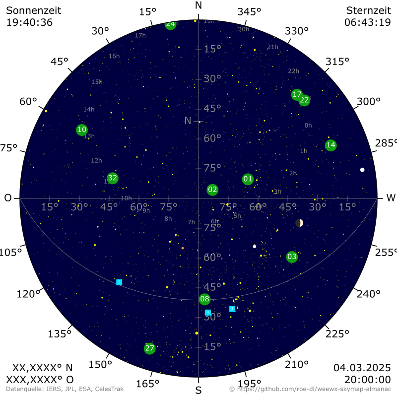

# weewx-skymap-almanac
Sky map for WeeWX



## Prerequisites

WeeWX from version 5.2 on and weewx-skyfield-almanac

## Installation instructions

1) download

   ```shell
   wget -O weewx-skymap-almanac.zip https://github.com/roe-dl/weewx-skymap-almanac/archive/master.zip
   ```

2) run the installer

   WeeWX from version 5.2 on and WeeWX packet installation

   ```shell
   sudo weectl extension install weewx-skymap-almanac.zip
   ```

   WeeWX from version 5.2 on and WeeWX pip installation into an virtual environment

   ```shell
   source ~/weewx-venv/bin/activate
   weectl extension install weewx-skymap-almanac.zip
   ```
   
3) restart weewx

   for SysVinit systems:

   ```shell
   sudo /etc/init.d/weewx stop
   sudo /etc/init.d/weewx start
   ```

   for systemd systems:

   ```shell
   sudo systemctl stop weewx
   sudo systemctl start weewx
   ```

## Configuration instructions

There is no need to configure anything, but there are some tuning options
available if you have special requirements.

```
[Almanac]
    [[Skymap]]
        # use this almanac
        enable = true
        # list of heavenly bodies to include in the map
        bodies = ...
        # list of earth satellites to include in the map
        earth_satellites = ...
        # maximum star magnitude to include in the map
        max_magnitude = 6.0
        # flag whether to include stars in the map
        show_stars = true
        # flag whether to include the timestamp
        show_timestamp = true
        # flag whether to include the location
        show_location = true
        # format options
        [[[Formats]]]
            stars = mag, '#ff0'
            object_name = size, color, ...
```

* `enable`: Enable this almanac extension.
* `bodies`: List of heavenly bodies to include in the map. Optional.
  Default the sun, the moon, and the well-known planets.
  This can include all objects available in BSP files.
* `earth_satellites`: List of earth satellites to include in the map.
  Optional. Default no satellites.
  The ID to use here contains of the file name of the
  satellite data file (without file name extension) and
  the catalog number of the satellite, connected by an underscore.
* `max_magnitude`: Maximum star magnitude to include in the map.
  Optional. Default is 6.0. This is, how you would see the sky
  in a clear night in the middle of nowhere. Try 4.0 if that
  looks more the way you know the sky in the night to be.
  Please note, the larger the magnitude, the fainter the star.
* `show_stars`: Flag whether to include stars in the map. Optional.
  Default `True`.
* `show_timestamp`: Flag whether to include the timestamp. Optional.
  Default `True`.
* `show_location`: Flag whether to include the location. Optional.
  Default `True`.
* `[[[Formats]]]`: Format options. Optional.
  There are reasonable defaults. So you do not need this section at all.
  But if you want to set up something special you can do it here.
  Each entry contains an object name and a list of options. For example
  the line `stars = mag, "#ff0"` says that the stars are to be drawn
  with a diameter according to their magnitude and a color of yellow.
  This is also the default if no option is specified. A line 
  `mars_barycenter = 0.85, "#ff8f5e"` would draw the planet Mars
  with a radius of 0.85 and a reddish color. This is the default, too.
  For earth satellites a third parameter is possible describing the
  shape of the representation of the object. For example it can be
  `round` or `square`.

## Usage

### Sky map

Add `$almanac.skymap` to your skin.

The map shows the sky as you would see it if you were lying on the ground, 
your legs to the south, and looking upwards. The size of the heavenly bodies 
on the map is not according to scale.

You can change the size of the map or other properties by setting parameters
like `$almanac.skymap(width=1200)`.

### Moon with moon phase

Add `$almanac.moon_symbol` to your skin.

You can change the size of the symbol by setting the parameter `width` like
`$almanac.moon_symbol(width=200)`.

## Time

The sky map image contains different timestamps:

* **Solar time**: In the upper left corner you find the apparent solar time.
  That is the time a sundial would show. It represents the position of the
  sun in the sky.
* **Sidereal time**: In the upper right corner you find the apparent 
  sidereal time. 
* **Civil time**: Civil time you find in the lower right corner together
  with the date.

## Links

* [WeeWX](https://weewx.com)
* [weewx-skyfield-almanac](https://github.com/roe-dl/weewx-skyfield-almanac)
