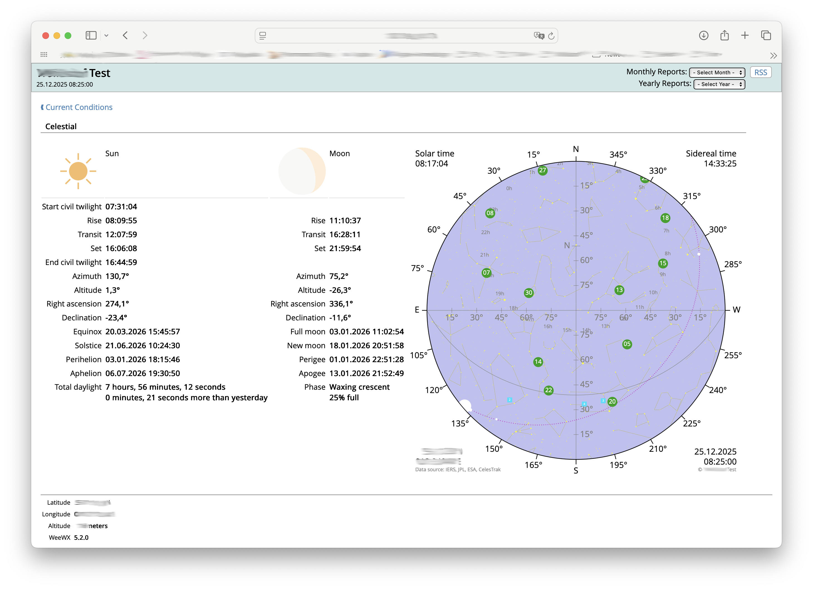

# Replacement almanac page for the WeeWX Seasons skin

This example replaces the original almanac page of the WeeWX built-in
Seasons skin by an extended one, that shows additional values, the
moon phase and moon tilt as a picture and the sky map from this extension.

## Usage

Simply replace the original `celestial.inc` file of the Seasons skin by
the file provided here.

## Localization

To adapt the labels to your language look for the appropriate language
file in the `lang` subdirectory of the Seasons skin. For example, if you 
are french, look for `fr.conf`. There you can add the words you need to 
translate. 

In section `[Texts]`:

Key = English | French    | German   | Dutch      | Czech    | Norwegian
--------------|-----------|----------|------------|----------|-----------
Perihelion    | Périhélie | Perihel  | Perihelium | Perihel  | Perihel
Aphelion      | Aphélie   | Aphel    | Aphelium   | Afel     | Aphel
Perigee       | Périgée   | Perigäum | Perigeum   | Perigeum | Perigeum
Apogee        | Apogée    | Apogäum  | Apogeum    | Apogeum  | Apogeum

In section `[Texts]`, subsection `[[Astronomical]]`:

Key = English | French        | German     | Dutch       | Czech        | Norwegian
--------------|---------------|------------|-------------|--------------|----------
Solar time    | Temps solaire | Sonnenzeit | Zonnetijd   | Sluneční čas | Soltid
Sidereal time | Temps sidéral | Sternzeit  | Sterrentijd | Hvězdný čas  | Stjernetid
Magnitude     | Magnitude     | Magnitude  | Magnitude   | Hvězdná velikost | Magnitude
First point of Aries | Point Vernal | Frühlingspunkt | Lentepunt | Jarní bod | Værens punkt
Apparent size | Taille apparente | Scheinbare Größe | | Úhlová velikost | Tilsynelatende størrelse
Moon tilt     | Inclinaison   | Neigung    | | | Månetilt
Distance      | Distance      | Entfernung | Afstand     | Vzdálenost | fra et himmellegeme
