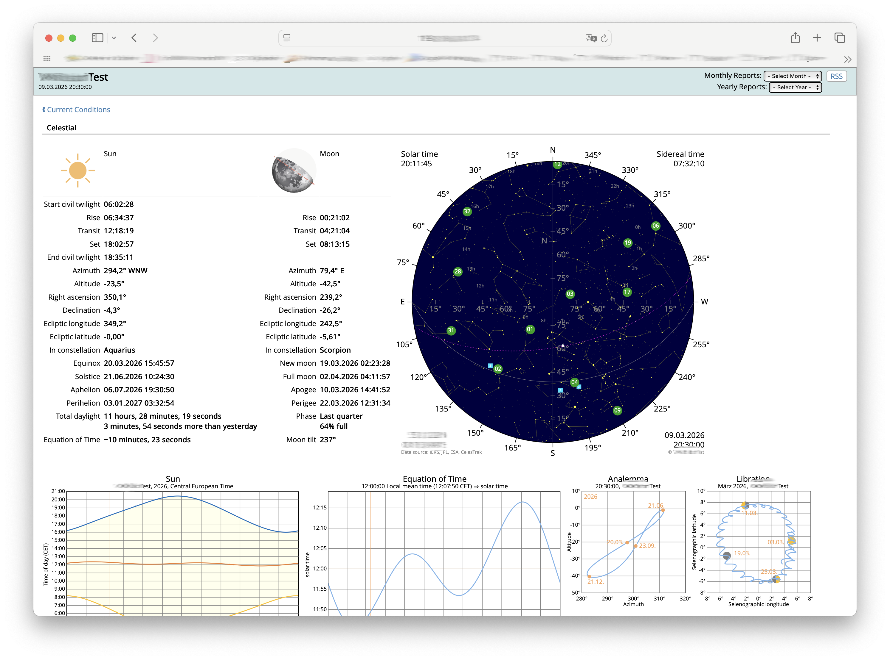

# Replacement almanac page for the WeeWX Seasons skin

This example replaces the original almanac page of the WeeWX built-in
Seasons skin by an extended one, that shows additional values, the
moon phase and moon tilt as a picture, the sky map, and diagrams from 
this extension.

## Usage

Simply replace the original `celestial.inc` file of the Seasons skin by
the file provided here.



## Earth Satellites

If you want to show Earth satellites on the map, you need to add 
configuration entries to section `[Almanac]`, sub-section `[[Skyfield]]`,
sub-sub-section `[[[EarthSatellites]]]` in `weewx.conf`. The lines
look like this:

```
            file_name = url
```

For example, to show the weather satellites use:

```
            weather.tle = https://celestrak.org/NORAD/elements/gp.php?GROUP=weather&FORMAT=tle
```

> [!CAUTION]
> To process file in formats other than TLE you need at least Skyfield
> 1.49.

Then, in section `[Almanac]`, sub-section `[[Skymap]]`, add the key
`earth_satellites` with a comma separated list of satellites as the 
value. A satellite is referenced here by the name of the file without
the file type, an underscore, and the international catalog number of
the satellite.

In the above example, that would be:

```
        earth_satellites = weather_40732, weather_38552, weather_28912
```

For more information see 
[weewx-skyfield-alamanc readme](https://github.com/roe-dl/weewx-skyfield-almanac?tab=readme-ov-file#earth-satellites)
and
[CelesTrak](https://celestrak.org/NORAD/elements/).

Make sure you re-started WeeWX after changing `weewx.conf`.

## Localization

To adapt the labels to your language look for the appropriate language
file in the `lang` subdirectory of the Seasons skin. For example, if you 
are french, look for `fr.conf`. There you can add the words you need to 
translate. 

In section `[Texts]`:

Key = English | French    | German   | Dutch      | Czech    | Norwegian
--------------|-----------|----------|------------|----------|-----------
Perihelion    | Périhélie | Perihel  | Perihelium | Perihel  | Perihel
Aphelion      | Aphélie   | Aphel    | Aphelium   | Afel     | Aphel
Perigee       | Périgée   | Perigäum | Perigeum   | Perigeum | Perigeum
Apogee        | Apogée    | Apogäum  | Apogeum    | Apogeum  | Apogeum
Equation of Time | Équation du temps | Zeitgleichung | Tijdsvereffening | Časová rovnice |

In section `[Almanac]`, subsection `[[TZ]]`:

Key        | English       | French        | German     | Dutch       | Czech        | Norwegian
-----------|---------------|---------------|------------|-------------|--------------|----------
name(LAT)  | Solar time    | Temps solaire | Sonnenzeit | Zonnetijd   | Sluneční čas | Soltid
name(LAST) | Sidereal time | Temps sidéral | Sternzeit  | Sterrentijd | Hvězdný čas  | Stjernetid

Add the name of your local timezone, too.

In section `[Texts]`, subsection `[[Astronomical]]`:

Key = English | French        | German     | Dutch       | Czech        | Norwegian
--------------|---------------|------------|-------------|--------------|----------
Magnitude     | Magnitude     | Magnitude  | Magnitude   | Hvězdná velikost | Magnitude
First point of Aries | Point Vernal | Frühlingspunkt | Lentepunt | Jarní bod | Værens punkt
Apparent size | Taille apparente | Scheinbare Größe | | Úhlová velikost | Tilsynelatende størrelse
Moon tilt     | Inclinaison   | Neigung    | | | Månetilt
Distance      | Distance      | Entfernung | Afstand     | Vzdálenost | fra et himmellegeme

## Troubleshooting

You can switch off the almanac extensions by setting `enable=false` in
section `[Almanac]` in `weewx.conf`. Try switching off the Skymap extension 
first, and if the error persists, the Skyfield extension, too. Make sure
to restart WeeWX after changing `weewx.conf`.

This replacement page checks for the availability of the extensions and
regards it appropriately.
